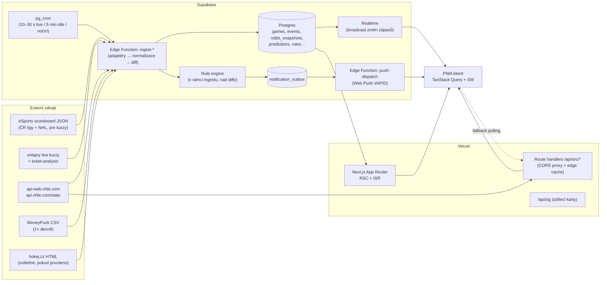

# HokejHub — návrh architektury (ke schválení)

## 1. Přehled



**Princip:** klient nikdy nevolá cizí API přímo (kromě CORS-otevřeného eSports JSON jako nouzový fallback). Pravda je v DB; live změny tlačí Supabase Realtime; proxy slouží pro on-demand data, která neukládáme (např. detail hráče NHL) a jako záložní polling.

## 2. Klíčová rozhodnutí

| Oblast | Návrh | Proč |
|---|---|---|
| Monorepo | pnpm workspaces: `apps/web`, `packages/core`, `supabase/`, `ml/` | Sdílené typy a modely (Elo, win prob, xG inference) mezi webem a ingestem |
| Frontend | Next.js 15 App Router, TS strict, Tailwind v4, TanStack Query, Motion (framer-motion) pro animace, `@serwist/next` pro SW | Standard, rychlé RSC, spolehlivý SW |
| Grafy | Vlastní SVG (shot mapa, kluziště, win-prob, momentum) + `visx` pro osy/škály | Výkon + plná kontrola nad designem |
| Ingest | **Supabase Edge Functions (Deno) spouštěné `pg_cron` + `pg_net`** | Vercel Cron na Hobby běží max 1×/den; pg_cron umí sub-minutové intervaly. Adaptivní kadence: když v DB není žádný živý zápas, funkce se vrátí okamžitě |
| Live do klienta | Supabase Realtime (broadcast kanál `game:{id}` + `scoreboard:{date}`) | Žádný polling z tisíců klientů; fallback polling 20–30 s |
| Proxy | Next.js route handlers (`/api/src/nhl/[...path]`) s allowlistem cest, `s-maxage` dle zdroje, stale-while-revalidate | Řeší CORS, cachuje, chrání zdroje |
| DB | Supabase Postgres + RLS; `pg_trgm` + FTS pro vyhledávání | |
| Auth | Supabase Auth (magic link + passkey/Google) — anonymní režim s lokálními oblíbenými | Oblíbené a pravidla bez nutnosti účtu, sync po přihlášení |
| Predikce | TS v `packages/core/model` (Elo, Poisson/Skellam, live WP, market de-vig); xG trénink v Pythonu (`ml/`), export `xg-model.json` | Inference běží všude bez Python služby; Python jen offline |
| Push | Web Push VAPID; pravidla vyhodnocuje ingest nad **diffy stavu**; outbox tabulka s `dedupe_key` UNIQUE; dispatcher odesílá a maže expirované subscription (410) | Idempotence, žádná duplicita |
| LLM souhrny | Po `FINAL` → job → Claude API → uložit `game_summaries` | Levné, asynchronní |
| Validace zdrojů | zod schémata v adaptérech; chyba → `source_health` + stav „zpožděno" v UI | Odolnost vůči změnám API |
| Hosting | Vercel (web + proxy + OG) + Supabase (DB, cron, functions, realtime, auth) | |

## 3. Struktura složek

```
hokejhub/
├─ apps/web/                      # Next.js
│  ├─ app/
│  │  ├─ (hub)/page.tsx           # personalizovaný feed / dnešek
│  │  ├─ live/page.tsx            # scoreboard + multi-view
│  │  ├─ zapas/[gameId]/          # game center (tabs: přehled, pbp, sestavy, shot mapa, kurzy, predikce)
│  │  ├─ liga/[league]/           # tabulka, rozpis, statistiky, pavouk
│  │  ├─ tym/[teamId]/  hrac/[playerId]/
│  │  ├─ predikce/  archiv/  hledat/  nastaveni/notifikace/
│  │  └─ api/src/[source]/[...path]/route.ts   # CORS proxy
│  ├─ components/ (ui/, rink/, charts/, game/)
│  ├─ lib/ (supabase, query keys, realtime hooks)
│  └─ public/ (manifest, ikony)
├─ packages/core/                 # čisté TS, bez Node API → importovatelné i z Deno
│  ├─ sources/ (esports.ts, onlajny-odds.ts, ticket-analysis.ts, nhl.ts, moneypuck.ts)  # fetch + zod + normalize
│  ├─ domain/ (types.ts, leagues.ts, status.ts)
│  ├─ model/ (elo.ts, poisson.ts, winprob.ts, xg.ts, market.ts)
│  └─ rules/ (engine.ts, triggers.ts)        # diff(prev,next) → události → match pravidel
├─ supabase/
│  ├─ migrations/*.sql
│  ├─ functions/ (ingest-scoreboard, ingest-live, ingest-nhl-game, ingest-daily, push-dispatch, summarize-game)
│  └─ seed.sql (ligy, mapování ID)
├─ ml/ (xg/train.py, notebooks, export → packages/core/model/xg-model.json)
└─ docs/ (research.md, architecture.md, adr/)
```

## 4. Datový model (Postgres)

```sql
-- Referenční
league(id text pk, name, country, tier, source_ids jsonb, color, sort)         -- 'cz-elh', 'nhl', ...
season(id text pk, league_id fk, label, start_date, end_date)
team(id uuid pk, league_id, name, short_name, abbrev, logo_url, external jsonb)  -- external: {onlajny_id, hokejcz_id, nhl_id}
player(id uuid pk, name, birth_date, position, shoots, nationality, headshot, external jsonb, search tsvector)
roster(team_id, season_id, player_id, number, pk(team_id, season_id, player_id))

-- Zápasy
game(id uuid pk, league_id, season_id, start_at timestamptz, home_team_id, away_team_id,
     status text,               -- scheduled|live|intermission|final|postponed
     period int, clock text, strength text,
     home_score int, away_score int, periods jsonb, decided_in text,  -- REG|OT|SO
     series text, venue text, external jsonb, updated_at, source_updated_at)
game_event(id bigserial, game_id, seq int, type text, period, clock, team_id, player_ids uuid[],
           x real, y real, shot_type, situation text, xg real, payload jsonb,
           unique(game_id, seq))                          -- NHL pbp; ELH góly/tresty pokud dostupné
box_skater(game_id, player_id, team_id, toi_s, g, a, pts, pm, sog, hits, blk, fo_w, fo_l, pim, pp_toi_s, sh_toi_s, extra jsonb)
box_goalie(game_id, player_id, team_id, toi_s, sa, ga, sv_pct, extra jsonb)
game_state_log(game_id, at timestamptz, home_score, away_score, period, clock, strength, win_prob_home real)  -- pro grafy momenta

-- Kurzy
odds_snapshot(id bigserial, game_id, bookmaker text, market text, phase text, -- pre|live
              home real, draw real, away real, captured_at, unique(game_id,bookmaker,market,captured_at))
bet_distribution(game_id, captured_at, payload jsonb, home_pct, draw_pct, away_pct)

-- Tabulky a statistiky
standing_snapshot(league_id, season_id, date, team_id, gp, w, otw, otl, l, gf, ga, pts, rank, pk(...))  -- tabulky v čase
player_season_stats(player_id, season_id, team_id, kind, stats jsonb)

-- Predikce
team_rating(team_id, as_of date, elo real, att real, def real, pk(team_id, as_of))
prediction(game_id, model text, version text, created_at, p_home real, p_draw real, p_away real,
           exp_home real, exp_away real, market_p jsonb, edge jsonb, pk(game_id, model, version))
game_summary(game_id pk, lang, text, model, created_at)

-- Uživatelé
profile(user_id pk → auth.users, display_name, tz, quiet_from time, quiet_to time, prefs jsonb)
favorite(user_id, kind text, ref_id uuid, pk(user_id, kind, ref_id))       -- team|player|league
push_subscription(id uuid pk, user_id, endpoint text unique, p256dh, auth, ua, created_at, last_ok_at)
notification_rule(id uuid pk, user_id, trigger text, scope jsonb, enabled bool, params jsonb)
    -- trigger: game_start|period_start|goal|fav_goal|power_play|tie|lead_change|close_finish|ot|so|final|odds_move|lineup|injury
    -- scope: {leagues:[], teams:[], players:[], favoritesOnly:true}
notification_outbox(id bigserial, user_id, dedupe_key text unique, payload jsonb, url text,
                    created_at, sent_at, error)
-- Tipovačka (P2)
pick_league, pick(user_id, game_id, choice, created_at) …

-- Provoz
source_health(source text pk, last_ok_at, last_error_at, last_error, etag, last_modified)
ingest_cursor(key text pk, value jsonb)
```

RLS: veřejné čtení referenčních a zápasových tabulek; uživatelské tabulky jen `auth.uid() = user_id`; zápis jen `service_role` (ingest).

## 5. Datové toky

| Job | Kadence | Co dělá |
|---|---|---|
| `ingest-scoreboard` | 20 s pokud existuje live/brzy začínající zápas, jinak 5 min | eSports scoreboard (dnes ± 1 den) → upsert `game`, diff → `game_state_log`, pravidla, Realtime broadcast; pre kurzy → `odds_snapshot` pouze při změně |
| `ingest-live-odds` | 30 s během live | `tipsport-live.json` (If-Modified-Since) → `odds_snapshot(phase=live)` při změně; pravidlo `odds_move` |
| `ingest-ticket-analysis` | 10 min před zápasem, 5 min live | `bet_distribution` |
| `ingest-nhl-game` | 15 s pro živé NHL zápasy | pbp → `game_event` (nové `seq`), xG inference, live WP, box score |
| `ingest-daily` | noc | rozpisy +14 dní, NHL standings, rosters (diff → `lineup`/`injury` pravidla), MoneyPuck CSV, přepočet Elo, predikce na další dny, `standing_snapshot` |
| `backfill` | ručně | NHL sezóny (1 req/s), eSports od 2025-02-20 |
| `push-dispatch` | trigger na insert do outboxu / 10 s | tiché hodiny, rate-limit na uživatele, Web Push, 404/410 → smazat subscription |

**Rule engine:** `diff(prevGame, nextGame) → DomainEvent[]` (GoalScored, PeriodStarted, GameFinal, LeadChanged, Tied, CloseFinish, PowerPlayStarted, OddsMoved, …) → pro každou událost SQL dotaz na pravidla s odpovídajícím triggerem a scope (index na `trigger`, GIN na `scope`) → insert do outboxu s `dedupe_key = user:rule:game:event_key` (`ON CONFLICT DO NOTHING`).

## 6. Milníky

| Milník | Obsah | Hotovo když |
|---|---|---|
| **M1 Scaffolding** | monorepo, Next.js + Tailwind + PWA manifest/SW, Supabase migrace, `packages/core` adaptéry se zod + unit testy na fixtures, proxy route, CI (lint, typecheck, test) | `pnpm dev` běží, testy zelené, deploy preview na Vercelu |
| **M2 MVP** | live scoreboard (ELH, Maxa, NHL + filtr lig), game center (skóre, třetiny, NHL pbp/box), pre/live kurzy + chytré peníze, 18+ banner, dark/light | lze sledovat živý zápas ELH i NHL |
| **M3 Ingest + historie** | pg_cron joby, archiv, tabulky (ELH počítaná / NHL oficiální), rozpisy, H2H, forma, vyhledávání | data se sama plní, archiv od 02/2025 (ČR) a 2010+ (NHL backfill) |
| **M4 Predikce** | Elo + Poisson, live WP + graf momenta, model vs. trh, backtest stránka | kalibrační graf a log-loss na historii |
| **M5 xG + shot mapy** | Python trénink, JSON model, shot mapa, xG timeline, xPoints | AUC ≥ 0,75 na holdout sezóně, srovnání s MoneyPuck |
| **M6 Notifikace** | VAPID, subscription UI, pravidla, tiché hodiny, dedup, deep link | E2E: gól v NHL → push do 30 s |
| **M7 Fan hub + design pass** | oblíbené feed, LLM souhrny, sdílecí karty, porovnání, rekordy, animace (gól, PP), haptika, a11y audit | Lighthouse ≥ 95 (perf/a11y/PWA) |
| **M8 „2030"** | tipovačka, playoff Monte Carlo, EDGE vizualizace, další ligy | — |

## 7. Otázky k odsouhlasení

1. **Ingest na Supabase Edge Functions + pg_cron** (místo Vercel Cron) — OK? Alternativa: Vercel Pro (cron po minutě, ale ne po 20 s) nebo malý worker na Fly.io.
2. **Monorepo s pnpm** a sdíleným `packages/core` — OK?
3. **hokej.cz box score:** souhlasíš, že ho při blokaci IP vynecháme (a případně zkusíš kontaktovat ČSLH/eSports o souhlas)?
4. **Auth:** anonymní použití + volitelné přihlášení (magic link) — OK?
5. **Jazyk UI:** čeština primárně (i18n připravené na EN)?
6. Máš už Supabase projekt a Vercel team, nebo mám psát vše tak, aby šlo spustit lokálně (`supabase start`) a deploy nastavíš sám?
